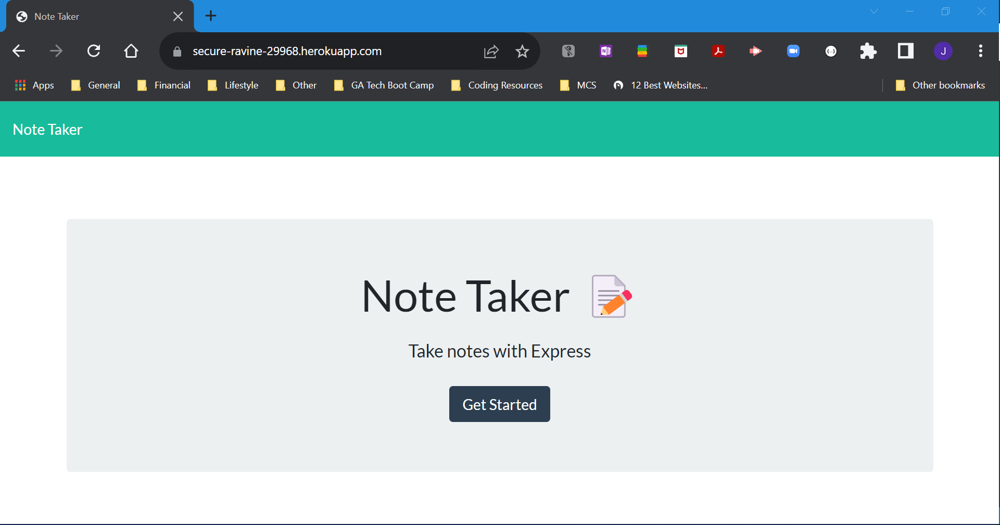
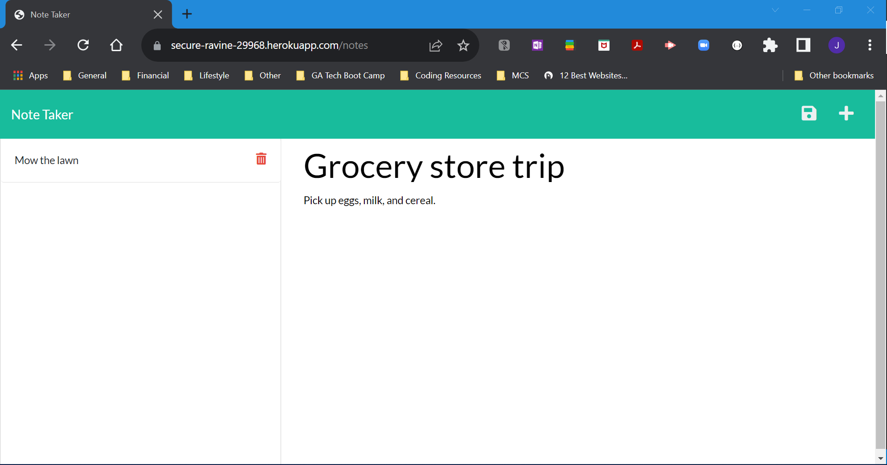
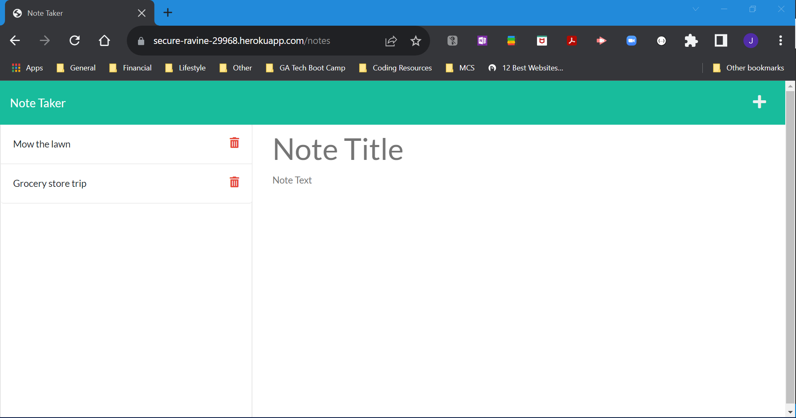

# module11-note-taker-challenge

## Description

In this challenge, I added routing and logic to the provided source code to meet all acceptance criteria so the note-taker application functions correctly given user interaction with the web page. Additionally, this web app has been deployed using Heroku.

## Screenshot

## Link

To view the deployed website, [CLICK HERE](https://secure-ravine-29968.herokuapp.com/).